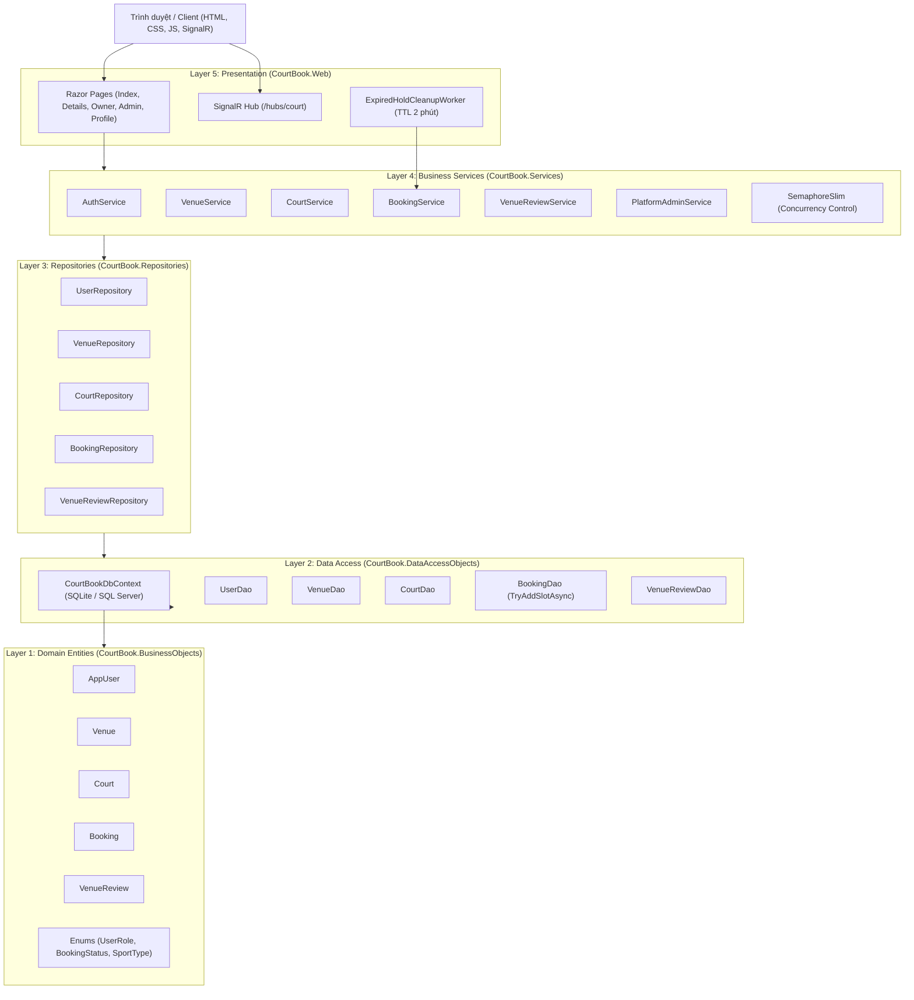

# Kiến Trúc Hệ Thống CourtBook (5-Layer PRN222 Architecture)

```mermaid
graph TD
    Client["Trình duyệt / Client (HTML, CSS, JS, SignalR)"]
    
    subgraph Presentation["Layer 5: Presentation (CourtBook.Web)"]
        RazorPages["Razor Pages (Index, Details, Owner, Admin, Profile)"]
        Hub["SignalR Hub (/hubs/court)"]
        Worker["ExpiredHoldCleanupWorker (TTL 2 phút)"]
    end
    
    subgraph Services["Layer 4: Business Services (CourtBook.Services)"]
        AuthSvc["AuthService"]
        VenueSvc["VenueService"]
        CourtSvc["CourtService"]
        BookingSvc["BookingService"]
        ReviewSvc["VenueReviewService"]
        AdminSvc["PlatformAdminService"]
        Semaphore["SemaphoreSlim (Concurrency Control)"]
    end
    
    subgraph Repositories["Layer 3: Repositories (CourtBook.Repositories)"]
        UserRepo["UserRepository"]
        VenueRepo["VenueRepository"]
        CourtRepo["CourtRepository"]
        BookingRepo["BookingRepository"]
        ReviewRepo["VenueReviewRepository"]
    end
    
    subgraph DAOs["Layer 2: Data Access (CourtBook.DataAccessObjects)"]
        DbContext["CourtBookDbContext (SQLite / SQL Server)"]
        UserDao["UserDao"]
        VenueDao["VenueDao"]
        CourtDao["CourtDao"]
        BookingDao["BookingDao (TryAddSlotAsync)"]
        ReviewDao["VenueReviewDao"]
    end
    
    subgraph BusinessObjects["Layer 1: Domain Entities (CourtBook.BusinessObjects)"]
        AppUser["AppUser"]
        Venue["Venue"]
        Court["Court"]
        Booking["Booking"]
        VenueReview["VenueReview"]
        Enums["Enums (UserRole, BookingStatus, SportType)"]
    end

    Client --> RazorPages
    Client --> Hub
    RazorPages --> Services
    Worker --> BookingSvc
    Services --> Repositories
    Repositories --> DAOs
    DAOs --> DbContext
    DbContext --> BusinessObjects
```
